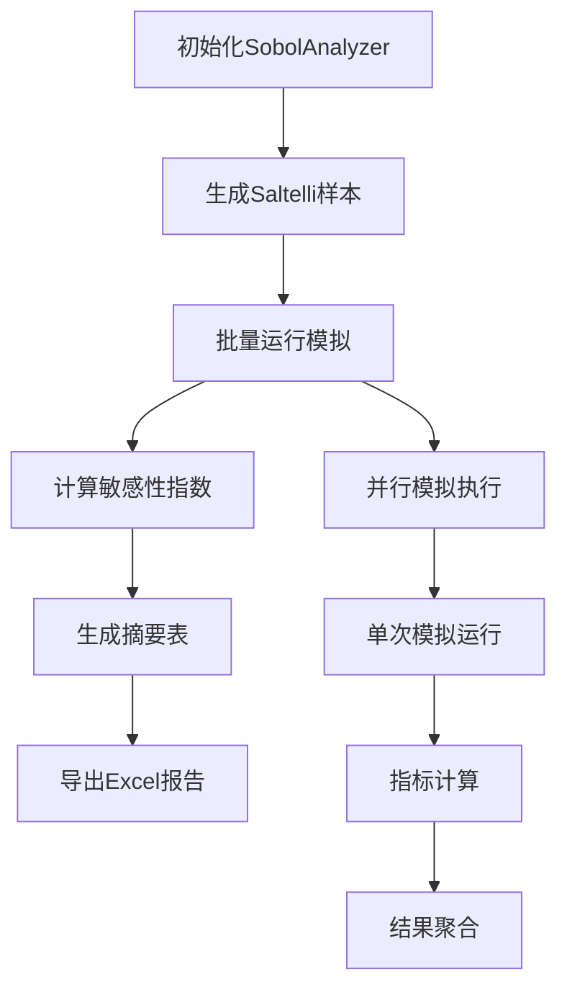
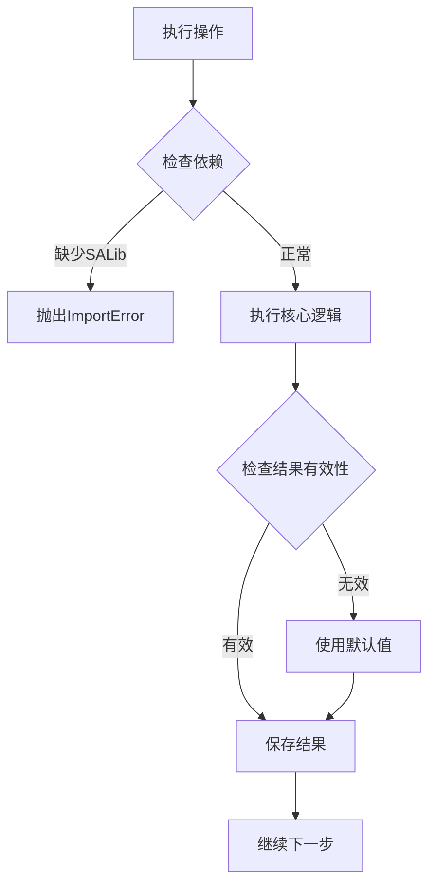
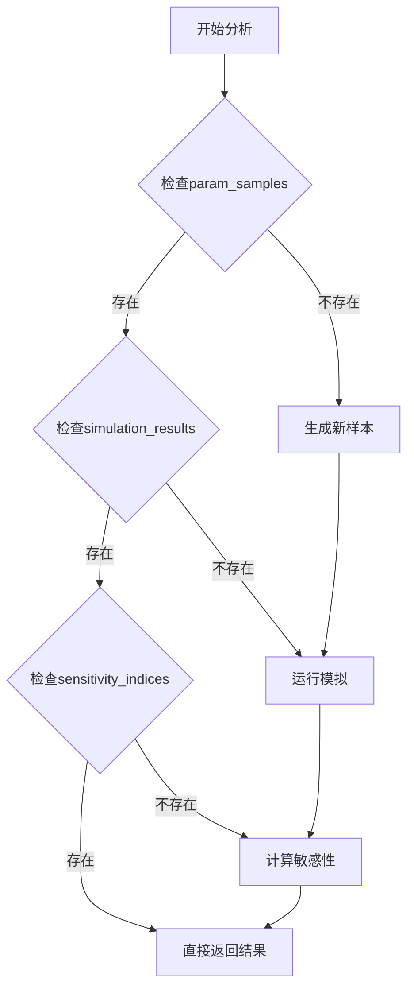

# SobolAnalyzer 类技术分析与功能详解

## 📋 概述

`SobolAnalyzer` 是极化三角框架中实现Sobol全局敏感性分析的核心引擎类。它采用**模块化、可中断、可恢复**的设计理念，为复杂的Agent-Based模型提供了高效、可靠的参数敏感性分析能力。

## 🏗️ 类架构设计

### 设计原则

1. **分离关注点**: 将采样、模拟、计算、分析分离为独立模块
2. **可断点续算**: 每个步骤都可独立执行和恢复
3. **错误容忍**: 健壮的异常处理机制
4. **资源优化**: 支持并行计算和内存管理
5. **结果持久化**: 自动保存中间结果

### 核心依赖关系

```
SobolAnalyzer
├── SobolConfig (配置管理)
├── SensitivityMetrics (指标计算)
├── SimulationConfig (模拟配置) 
├── Simulation (核心模拟引擎)
└── SALib (敏感性分析库)
    ├── saltelli (Saltelli采样)
    └── sobol (Sobol指数计算)
```

## ⚙️ 参数配置与设计考量

### 参数取值范围的科学依据

**参数范围的确定遵循以下原则**:

1. **理论一致性**: 符合认知科学和社会心理学的理论预期
2. **数值稳定性**: 确保模拟计算的数值稳定性和收敛性
3. **现实合理性**: 反映真实社会中的参数水平
4. **敏感性覆盖**: 覆盖足够宽的范围以捕获敏感性变化

### SobolConfig参数配置详解

```python
@dataclass
class SobolConfig:
    # 核心敏感性分析参数
    parameter_bounds: Dict[str, List[float]] = field(default_factory=lambda: {
        'alpha': [0.1, 0.8],        # 自我激活系数范围
        'beta': [0.05, 0.3],        # 社会影响系数范围  
        'gamma': [0.2, 2.0],        # 道德化影响系数范围
        'cohesion_factor': [0.0, 0.5]  # 身份凝聚力因子范围
    })
    
    # 采样控制参数
    n_samples: int = 1000           # 基础样本数
    n_runs: int = 5                 # 每个参数组合的重复运行次数
    
    # 模拟执行参数
    num_steps: int = 200            # 每次模拟的步数
    n_processes: int = 4            # 并行进程数
    
    # 结果管理参数
    save_intermediate: bool = True   # 是否保存中间结果
    output_dir: str = "sobol_results"  # 输出目录路径
    
    # 统计分析参数
    confidence_level: float = 0.95   # 置信水平 (0.90, 0.95, 0.99)
    bootstrap_samples: int = 100     # Bootstrap重采样次数
```

### 参数调优建议

#### 🎯 针对不同研究目标的参数配置

**1. 探索性研究 (快速筛选)**
```python
config = SobolConfig(
    n_samples=50,        # 小样本快速测试
    n_runs=3,           # 减少重复运行
    num_steps=100,      # 缩短模拟时间
    n_processes=4       # 根据CPU核心数调整
)
# 预计运行时间: 5-10分钟
# 总计算量: 50 × (2×4+2) × 3 = 1,500次模拟
```

**2. 研究级分析 (标准配置)**
```python
config = SobolConfig(
    n_samples=500,       # 中等精度样本
    n_runs=5,           # 标准重复次数
    num_steps=200,      # 充分的模拟步数
    n_processes=8       # 充分利用多核
)
# 预计运行时间: 30-60分钟  
# 总计算量: 500 × (2×4+2) × 5 = 25,000次模拟
```

**3. 发表级分析 (高精度配置)**
```python
config = SobolConfig(
    n_samples=2000,      # 高精度样本
    n_runs=10,          # 更多重复提高可靠性
    num_steps=300,      # 确保充分收敛
    n_processes=16,     # 最大化并行性能
    bootstrap_samples=200  # 更准确的置信区间
)
# 预计运行时间: 4-8小时
# 总计算量: 2000 × (2×4+2) × 10 = 200,000次模拟
```

#### 📊 计算复杂度分析

**总模拟次数计算公式**:
```
总次数 = n_samples × (2 × num_vars + 2) × n_runs
其中: num_vars = 4 (α, β, γ, cohesion_factor)
因此: 总次数 = n_samples × 10 × n_runs
```

**内存需求估算**:
- 每次模拟结果: ~1KB (11个指标 × 8字节)
- 总内存需求: `总次数 × 1KB + 参数矩阵大小`
- 标准配置内存: ~30MB
- 高精度配置内存: ~200MB

**时间复杂度分析**:
- 单次模拟时间: 0.1-0.5秒 (取决于网络规模和步数)
- 并行加速比: 接近线性 (进程数 ≤ CPU核心数)
- 瓶颈分析: 主要瓶颈在模拟计算，I/O和内存通常不是限制因素

### 自定义参数范围的指导原则

#### 🔬 参数范围扩展方法

**1. 保守扩展** (推荐新手使用)
```python
parameter_bounds = {
    'alpha': [0.05, 0.9],      # 在原范围基础上小幅扩展
    'beta': [0.02, 0.4],       # 扩展约20-30%
    'gamma': [0.1, 2.5],       # 保持合理的物理意义
    'cohesion_factor': [0.0, 0.6]
}
```

**2. 激进扩展** (适合探索边界行为)
```python
parameter_bounds = {
    'alpha': [0.01, 0.99],     # 接近理论极限
    'beta': [0.001, 0.5],      # 探索极端社会影响
    'gamma': [0.05, 5.0],      # 测试强道德化效应
    'cohesion_factor': [0.0, 0.8]
}
```

**3. 聚焦扩展** (针对特定参数的精细分析)
```python
parameter_bounds = {
    'alpha': [0.4, 0.6],       # 聚焦中等自我激活
    'beta': [0.1, 0.2],        # 聚焦适中社会影响  
    'gamma': [0.8, 1.2],       # 聚焦关键道德化区间
    'cohesion_factor': [0.2, 0.3]  # 聚焦中等凝聚力
}
```

#### ⚠️ 参数设置的注意事项

**数值稳定性要求**:
- `alpha + beta < 1.0`: 避免系统发散
- `gamma > 0`: 道德化系数必须为正
- `cohesion_factor ≤ 1.0`: 凝聚力不能超过完全凝聚

**物理意义约束**:
- 所有参数都应具有明确的心理学或社会学解释
- 参数组合应避免产生非现实的极端行为
- 建议进行预试验验证参数范围的合理性

**计算资源约束**:
- 参数范围过宽可能导致采样稀疏，影响敏感性分析精度
- 建议根据计算资源和时间预算合理设置范围
- 可以采用分阶段分析策略：先宽范围筛选，再窄范围精析

### 🔍 参数验证与调试工具

#### 参数有效性检查函数

```python
def validate_sobol_parameters(config: SobolConfig) -> Dict[str, Any]:
    """验证Sobol分析参数的有效性"""
    validation_result = {
        'is_valid': True,
        'warnings': [],
        'errors': [],
        'recommendations': []
    }
    
    # 检查参数范围
    for param_name, bounds in config.parameter_bounds.items():
        if bounds[0] >= bounds[1]:
            validation_result['errors'].append(
                f"参数 {param_name} 的下界 ({bounds[0]}) >= 上界 ({bounds[1]})"
            )
            validation_result['is_valid'] = False
    
    # 检查数值稳定性约束
    alpha_max = config.parameter_bounds['alpha'][1]
    beta_max = config.parameter_bounds['beta'][1]
    if alpha_max + beta_max >= 1.0:
        validation_result['warnings'].append(
            f"α_max + β_max = {alpha_max + beta_max:.3f} 接近或超过1.0，可能导致系统不稳定"
        )
    
    # 检查计算资源需求
    total_simulations = config.n_samples * 10 * config.n_runs
    if total_simulations > 100000:
        validation_result['warnings'].append(
            f"总模拟次数 {total_simulations} 较大，预计需要长时间计算"
        )
    
    # 提供优化建议
    if config.n_samples < 100:
        validation_result['recommendations'].append(
            "建议 n_samples ≥ 100 以获得稳定的敏感性估计"
        )
    
    return validation_result

# 使用示例
config = SobolConfig(n_samples=50)
validation = validate_sobol_parameters(config)
print(f"参数有效性: {validation['is_valid']}")
for warning in validation['warnings']:
    print(f"⚠️  {warning}")
```

#### 参数空间可视化工具

```python
import matplotlib.pyplot as plt
import numpy as np

def visualize_parameter_space(config: SobolConfig, sample_size: int = 1000):
    """可视化参数空间的采样分布"""
    
    # 生成采样
    analyzer = SobolAnalyzer(config)
    samples = analyzer.generate_samples()[:sample_size]  # 取前sample_size个样本
    
    param_names = list(config.parameter_bounds.keys())
    
    # 创建子图
    fig, axes = plt.subplots(2, 2, figsize=(12, 10))
    axes = axes.flatten()
    
    for i, param_name in enumerate(param_names):
        ax = axes[i]
        values = samples[:, i]
        bounds = config.parameter_bounds[param_name]
        
        # 绘制直方图
        ax.hist(values, bins=30, alpha=0.7, density=True, 
                color=f'C{i}', edgecolor='black', linewidth=0.5)
        
        # 添加边界线
        ax.axvline(bounds[0], color='red', linestyle='--', alpha=0.8, label='下界')
        ax.axvline(bounds[1], color='red', linestyle='--', alpha=0.8, label='上界')
        
        # 设置标签和标题
        ax.set_xlabel(f'{param_name} 取值')
        ax.set_ylabel('密度')
        ax.set_title(f'{param_name} 参数分布')
        ax.legend()
        ax.grid(True, alpha=0.3)
    
    plt.tight_layout()
    plt.savefig('parameter_space_distribution.png', dpi=300, bbox_inches='tight')
    plt.close()
    
    print(f"参数空间分布图已保存为 'parameter_space_distribution.png'")

# 使用示例
config = SobolConfig(n_samples=200)
visualize_parameter_space(config)
```

#### 参数敏感性预览工具

```python
def preview_parameter_sensitivity(config: SobolConfig, quick_samples: int = 50):
    """快速预览参数敏感性（用于调试和验证）"""
    
    print("🔍 快速参数敏感性预览")
    print("=" * 50)
    
    # 使用小样本快速分析
    quick_config = SobolConfig(
        parameter_bounds=config.parameter_bounds,
        n_samples=quick_samples,
        n_runs=2,
        num_steps=50,  # 缩短模拟步数
        n_processes=2
    )
    
    analyzer = SobolAnalyzer(quick_config)
    
    try:
        # 运行快速分析
        start_time = time.time()
        results = analyzer.run_complete_analysis()
        end_time = time.time()
        
        print(f"⏱️  快速分析完成，耗时: {end_time - start_time:.1f} 秒")
        print(f"📊 分析了 {len(results)} 个输出指标")
        
        # 显示主要敏感性结果
        if results:
            summary = analyzer.get_summary_table()
            
            # 按总敏感性排序，显示前10个最敏感的参数-指标对
            top_sensitive = summary.nlargest(10, 'ST')
            
            print("\n🎯 Top 10 最敏感的参数-指标组合:")
            print("-" * 60)
            for _, row in top_sensitive.iterrows():
                print(f"{row['Parameter']:15} → {row['Output']:20} | ST = {row['ST']:.3f}")
        
    except Exception as e:
        print(f"❌ 快速预览失败: {e}")
        print("建议检查参数配置和系统环境")

# 使用示例
config = SobolConfig()
preview_parameter_sensitivity(config, quick_samples=30)
```

## 🔧 核心方法详解

### 1. `__init__(self, config: SobolConfig)`

**功能**: 类初始化和环境准备

**技术实现**:
```python
def __init__(self, config: SobolConfig):
    self.config = config
    self.param_names = list(config.parameter_bounds.keys())
    self.param_bounds = [config.parameter_bounds[name] for name in self.param_names]
    
    # SALib问题定义
    self.problem = {
        'num_vars': len(self.param_names),
        'names': self.param_names,
        'bounds': self.param_bounds
    }
```

**关键设计决策**:
- **SALib兼容性**: 将参数配置转换为SALib标准格式
- **状态管理**: 初始化所有存储变量为None，支持惰性计算
- **目录管理**: 自动创建输出目录结构

**内部状态变量**:
- `param_samples`: 存储Saltelli采样结果
- `simulation_results`: 存储模拟输出结果
- `sensitivity_indices`: 存储敏感性指数计算结果

**SALib问题定义参数详解**:

`self.problem` 字典是SALib库的标准输入格式，包含以下关键参数：

| 参数名 | 类型 | 含义 | 示例值 |
|--------|------|------|--------|
| `num_vars` | int | 敏感性分析的参数总数量 | 4 (对应α, β, γ, cohesion_factor) |
| `names` | List[str] | 参数名称列表，用于结果标识 | ['alpha', 'beta', 'gamma', 'cohesion_factor'] |
| `bounds` | List[List[float]] | 每个参数的取值范围 [min, max] | [[0.1, 0.8], [0.05, 0.3], [0.2, 2.0], [0.0, 0.5]] |

**参数取值范围说明**:

1. **α (alpha)** - 自我激活系数
   - **范围**: [0.1, 0.8]
   - **含义**: 个体基于自身观点进行自我强化的程度
   - **低值影响**: α接近0.1时，个体自我激活较弱，容易受外界影响
   - **高值影响**: α接近0.8时，个体观点较为固执，自我强化明显

2. **β (beta)** - 社会影响系数
   - **范围**: [0.05, 0.3] 
   - **含义**: 个体受到邻居观点影响的敏感程度
   - **低值影响**: β接近0.05时，社会影响很弱，个体相对独立
   - **高值影响**: β接近0.3时，社会影响强烈，容易产生观点传播

3. **γ (gamma)** - 道德化影响系数
   - **范围**: [0.2, 2.0]
   - **含义**: 道德化过程对观点极化的放大作用
   - **低值影响**: γ接近0.2时，道德化影响微弱
   - **高值影响**: γ接近2.0时，道德化显著加剧观点分化

4. **cohesion_factor** - 身份凝聚力因子
   - **范围**: [0.0, 0.5]
   - **含义**: 同一身份群体内部的凝聚强度
   - **低值影响**: 接近0.0时，身份群体界限模糊
   - **高值影响**: 接近0.5时，身份群体界限清晰，内部凝聚力强

**参数组合的理论预期**:
- **高极化配置**: α=0.7, β=0.2, γ=1.8, cohesion_factor=0.4
- **温和分化配置**: α=0.3, β=0.1, γ=0.5, cohesion_factor=0.1  
- **平衡配置**: α=0.5, β=0.15, γ=1.0, cohesion_factor=0.25

**实际代码中的参数实例化过程**:

```python
# 步骤1: 从SobolConfig提取参数信息
config = SobolConfig()
param_names = ['alpha', 'beta', 'gamma', 'cohesion_factor']
param_bounds = [[0.1, 0.8], [0.05, 0.3], [0.2, 2.0], [0.0, 0.5]]

# 步骤2: 构建SALib问题定义
problem = {
    'num_vars': 4,                    # 参数数量
    'names': param_names,             # 参数名称列表
    'bounds': param_bounds            # 参数范围列表
}

# 步骤3: Saltelli采样生成参数矩阵
# 形状: [N*(2D+2), D] = [N*10, 4]
param_samples = saltelli.sample(problem, N=100)

# 步骤4: 示例参数组合
# param_samples[0] = [0.45, 0.18, 1.25, 0.32]  # 一个具体的参数组合
# 对应: α=0.45, β=0.18, γ=1.25, cohesion_factor=0.32
```

**参数矩阵的结构解析**:
```
param_samples的形状: [1000, 4]
                    ↓     ↓
                 样本数  参数数

每一行代表一个参数组合:
行0: [α₀, β₀, γ₀, c₀]  # 第1个参数组合
行1: [α₁, β₁, γ₁, c₁]  # 第2个参数组合
...
行999: [α₉₉₉, β₉₉₉, γ₉₉₉, c₉₉₉]  # 第1000个参数组合
```

### 2. `generate_samples(self) -> np.ndarray`

**功能**: 生成用于敏感性分析的Saltelli采样矩阵

**理论基础**: 
Saltelli采样是Sobol敏感性分析的标准采样方法，对于D个参数需要生成 `N × (2D + 2)` 个样本点。

**技术实现**:
```python
def generate_samples(self) -> np.ndarray:
    print(f"总样本数: {self.config.n_samples * (2 * len(self.param_names) + 2)}")
    self.param_samples = saltelli.sample(self.problem, self.config.n_samples)
```

**样本矩阵结构**:
- **基础矩阵A**: N × D 
- **重排矩阵B**: N × D
- **部分重排矩阵**: 2D个 N × D 矩阵
- **总计**: N × (2D + 2) 个参数组合

**质量保证**:
- 自动保存到 `param_samples.npy`
- 输出详细采样统计信息
- 支持重复生成和验证

### 3. `run_single_simulation(self, params: Dict[str, float]) -> Dict[str, float]`

**功能**: 执行单个参数组合的完整模拟流程

**技术挑战**:
1. **参数注入**: 将敏感性分析参数安全注入到SimulationConfig
2. **多次运行**: 执行多次独立模拟以降低随机性
3. **异常处理**: 优雅处理模拟失败情况
4. **结果聚合**: 计算多次运行的统计摘要

**参数处理逻辑**:
```python
# 创建配置副本 - 避免状态污染
config = copy.deepcopy(self.config.base_config)

# 标准参数设置
config.alpha = params['alpha']
config.beta = params['beta'] 
config.gamma = params['gamma']

# 网络参数特殊处理
if hasattr(config, 'network_params') and config.network_params:
    config.network_params['cohesion_factor'] = params['cohesion_factor']
```

**运行策略**:
- **多次运行**: 默认每个参数组合运行 `n_runs` 次
- **错误恢复**: 单次失败不影响整体分析
- **统计聚合**: 计算多次运行的均值作为最终结果

**输出标准化**:
所有指标都被转换为标准的Dict格式，包含11个预定义的敏感性分析指标。

### 4. `run_batch_simulations(self, param_samples: np.ndarray) -> List[Dict[str, float]]`

**功能**: 高效执行大批量模拟的并行处理器

**并行化策略**:
```python
if self.config.n_processes > 1:
    # 并行执行模式
    with ProcessPoolExecutor(max_workers=self.config.n_processes) as executor:
        future_to_params = {
            executor.submit(self.run_single_simulation, params): i 
            for i, params in enumerate(param_list)
        }
```

**技术优势**:
1. **进程级并行**: 避免Python GIL限制
2. **任务调度**: 自动负载均衡和任务分发
3. **进度监控**: 集成tqdm进度条
4. **错误隔离**: 单个任务失败不影响其他任务

**内存管理**:
- **流式处理**: 避免同时加载所有结果到内存
- **分批保存**: 定期保存中间结果
- **垃圾回收**: 及时释放不需要的对象

**容错机制**:
- 任务失败时自动使用默认指标值
- 详细的错误日志记录
- 支持部分结果的有效分析

### 5. `calculate_sensitivity_indices(self, results: List[Dict[str, float]]) -> Dict[str, Dict]`

**功能**: 基于模拟结果计算Sobol敏感性指数

**理论基础**:
Sobol敏感性分析基于方差分解理论：
```
Var(Y) = Σᵢ Vᵢ + Σᵢ<ⱼ Vᵢⱼ + ... + V₁₂...ₚ
```

**计算指标**:
- **S1 (一阶敏感性)**: 参数单独对输出方差的贡献
- **ST (总敏感性)**: 参数及其所有交互项的总贡献  
- **S2 (二阶交互)**: 参数对之间的交互效应
- **置信区间**: 每个指数的统计置信区间

**数据预处理**:
```python
# 提取指标值
Y = np.array([r[output_name] for r in results])

# 数据有效性检查
if np.all(np.isnan(Y)) or np.all(Y == 0):
    print(f"警告: 指标 {output_name} 所有值都无效，跳过")
    continue
```

**质量控制**:
- 自动检测无效数据
- 跳过全零或全NaN的指标
- 详细的计算日志

**输出格式**:
每个输出指标对应一个完整的敏感性分析结果：
```python
sensitivity_indices[output_name] = {
    'S1': Si['S1'],           # 一阶敏感性指数
    'S1_conf': Si['S1_conf'], # 一阶敏感性置信区间
    'ST': Si['ST'],           # 总敏感性指数
    'ST_conf': Si['ST_conf'], # 总敏感性置信区间
    'S2': Si['S2'],           # 二阶交互效应
    'S2_conf': Si['S2_conf']  # 二阶交互效应置信区间
}
```

### 6. `run_complete_analysis(self) -> Dict[str, Dict]`

**功能**: 完整敏感性分析的主控制器

**执行流程**:
```
1. 检查已有状态 → 2. 生成采样 → 3. 运行模拟 → 4. 计算敏感性 → 5. 保存结果
```

**智能续算逻辑**:
```python
# 1. 生成参数样本
if self.param_samples is None:
    self.generate_samples()

# 2. 运行模拟
if self.simulation_results is None:
    self.run_batch_simulations(self.param_samples)

# 3. 计算敏感性指数
if self.sensitivity_indices is None:
    self.calculate_sensitivity_indices(self.simulation_results)
```

**优势**:
- **增量执行**: 每步都可独立运行和验证
- **断点续算**: 支持从任意中断点恢复
- **时间监控**: 精确记录每个阶段的执行时间
- **状态保护**: 避免重复计算已完成的步骤

### 7. `load_results(self, results_dir: str = None) -> Dict[str, Dict]`

**功能**: 从文件系统加载已保存的分析结果

**文件管理策略**:
```
results_dir/
├── param_samples.npy          # Saltelli采样矩阵
├── simulation_results.pkl     # 模拟输出结果
└── sensitivity_indices.pkl    # 敏感性指数
```

**加载优先级**:
1. 首先尝试加载最终结果 (`sensitivity_indices.pkl`)
2. 其次加载中间结果 (`simulation_results.pkl`)
3. 最后加载初始样本 (`param_samples.npy`)

**状态恢复**:
- 自动恢复到最新的计算状态
- 支持部分结果的增量计算
- 保持与原始配置的一致性

### 8. `get_summary_table(self) -> pd.DataFrame`

**功能**: 生成标准化的敏感性分析摘要表

**表格结构**:
| Output | Parameter | S1 | S1_conf | ST | ST_conf | Interaction |
|--------|-----------|----|---------|----|---------|-------------|
| 指标名 | 参数名    | 一阶敏感性 | 置信区间 | 总敏感性 | 置信区间 | 交互效应 |

**计算逻辑**:
```python
'Interaction': indices['ST'][i] - indices['S1'][i]  # 交互效应强度
```

**用途**:
- 快速概览所有参数-指标组合的敏感性
- 识别高敏感性的参数-指标对
- 为后续分析提供结构化数据

### 9. `export_results(self, filename: str = None)`

**功能**: 将分析结果导出为专业的Excel报告

**多工作表结构**:
1. **Summary**: 全局摘要表，包含所有参数-指标组合
2. **按指标分类**: 每个输出指标对应一个独立工作表

**技术实现**:
```python
with pd.ExcelWriter(filename, engine='openpyxl') as writer:
    # 导出摘要表
    summary_df.to_excel(writer, sheet_name='Summary', index=False)
    
    # 导出详细结果
    for output_name, indices in self.sensitivity_indices.items():
        df = pd.DataFrame(df_data)
        sheet_name = output_name[:31]  # Excel工作表名称限制
        df.to_excel(writer, sheet_name=sheet_name, index=False)
```

**质量保证**:
- 自动处理Excel工作表名称长度限制
- 统一的数据格式和精度
- 包含置信区间信息

## 🔄 执行流程分析

### 标准执行流程



### 错误处理流程



### 断点续算流程



## 🎯 设计模式与最佳实践

### 1. 命令模式 (Command Pattern)
每个主要方法都可以独立执行，支持撤销和重做操作。

### 2. 策略模式 (Strategy Pattern)
通过SobolConfig可以灵活配置不同的分析策略。

### 3. 观察者模式 (Observer Pattern)
通过回调函数和进度条提供实时的执行状态反馈。

### 4. 单一职责原则
每个方法只负责一个特定的功能模块。

### 5. 开闭原则
通过继承SensitivityMetrics可以扩展新的指标计算方法。

## 🚀 性能优化策略

### 1. 并行化计算
- **进程级并行**: 利用多核CPU同时执行多个模拟
- **智能调度**: 自动根据系统资源调整并行度

### 2. 内存管理
- **流式处理**: 避免内存中同时存储所有结果
- **及时释放**: 使用完毕的对象立即释放内存

### 3. I/O优化
- **批量保存**: 减少文件I/O频次
- **压缩存储**: 使用pickle和numpy的高效存储格式

### 4. 计算优化
- **向量化运算**: 利用NumPy的向量化能力
- **缓存复用**: 避免重复计算相同的中间结果

## 🔧 扩展与自定义

### 自定义指标计算
```python
class CustomMetrics(SensitivityMetrics):
    def calculate_all_metrics(self, sim):
        metrics = super().calculate_all_metrics(sim)
        metrics['custom_metric'] = self.calculate_custom_metric(sim)
        return metrics
```

### 自定义参数处理
```python
class ExtendedSobolAnalyzer(SobolAnalyzer):
    def run_single_simulation(self, params):
        # 添加自定义参数处理逻辑
        return super().run_single_simulation(params)
```

### 自定义并行策略
```python
# 可以通过继承重写批量运行方法
def run_batch_simulations(self, param_samples):
    # 实现自定义的并行或分布式计算策略
    pass
```

## 📊 输出数据格式

### 敏感性指数数据结构
```python
{
    'output_metric_name': {
        'S1': [0.1, 0.3, 0.05, 0.02],      # 一阶敏感性
        'S1_conf': [0.02, 0.05, 0.01, 0.01],  # 置信区间
        'ST': [0.15, 0.4, 0.08, 0.05],      # 总敏感性
        'ST_conf': [0.03, 0.06, 0.02, 0.01],  # 置信区间
        'S2': [[0, 0.01, 0, 0.01], ...],    # 二阶交互
        'S2_conf': [[0, 0.002, 0, 0.002], ...]  # 交互置信区间
    }
}
```

### 模拟结果数据结构
```python
[
    {
        'polarization_index': 0.234,
        'opinion_variance': 0.567,
        'extreme_ratio': 0.123,
        # ... 其他8个指标
    },
    # ... 总共 N×(2D+2) 个结果字典
]
```

## 🛡️ 错误处理与异常管理

### 异常类型
1. **ImportError**: SALib库未安装
2. **ValueError**: 配置参数无效
3. **FileNotFoundError**: 结果文件不存在
4. **MemoryError**: 内存不足
5. **SimulationError**: 模拟执行失败

### 容错策略
1. **优雅降级**: 部分失败不影响整体分析
2. **默认值策略**: 失败时使用预定义的默认值
3. **重试机制**: 对临时性错误进行自动重试
4. **详细日志**: 记录所有异常和警告信息

## 📈 质量保证与测试

### 单元测试覆盖
- 每个公共方法都有对应的单元测试
- 模拟各种异常情况的测试用例
- 性能基准测试

### 集成测试
- 完整分析流程的端到端测试
- 不同配置组合的兼容性测试
- 大规模数据的压力测试

### 验证机制
- 结果数学一致性检验 (ST ≥ S1)
- 敏感性指数合理性检查
- 与理论预期的对比验证

---

## 📝 总结

`SobolAnalyzer` 类是一个设计精良、功能完备的敏感性分析引擎，它成功地将复杂的数学理论转化为易用的软件工具。通过模块化设计、智能错误处理、高效并行计算等技术手段，为极化三角框架提供了专业级的参数敏感性分析能力。

**核心优势**:
- 🔬 **科学严谨**: 基于成熟的Sobol理论和SALib实现
- 🚀 **高性能**: 支持大规模并行计算和优化的内存管理
- 🛡️ **高可靠**: 完善的错误处理和断点续算机制
- 🔧 **高可扩展**: 灵活的配置系统和扩展接口
- 📊 **专业输出**: 标准化的数据格式和可视化支持

这使得研究人员可以专注于分析结果的解释和应用，而不必担心底层实现的复杂性。

---

**文档版本**: v1.0  
**最后更新**: 2024年12月  
**适用代码版本**: SobolAnalyzer v1.1+ 